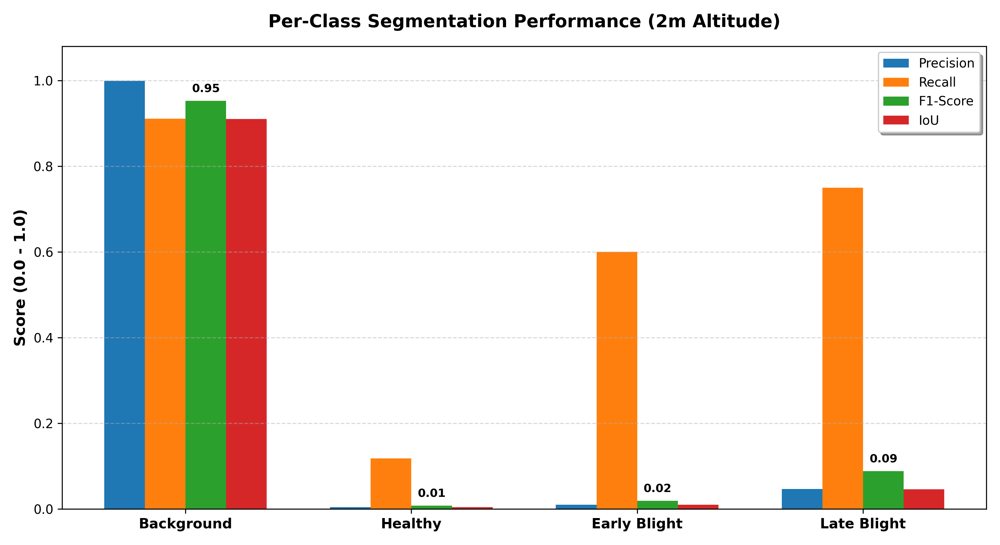
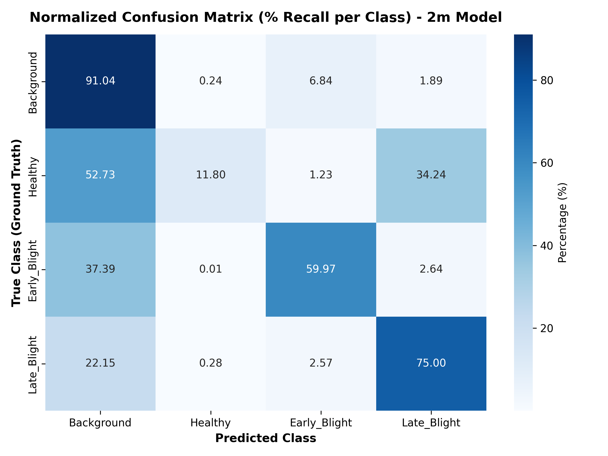
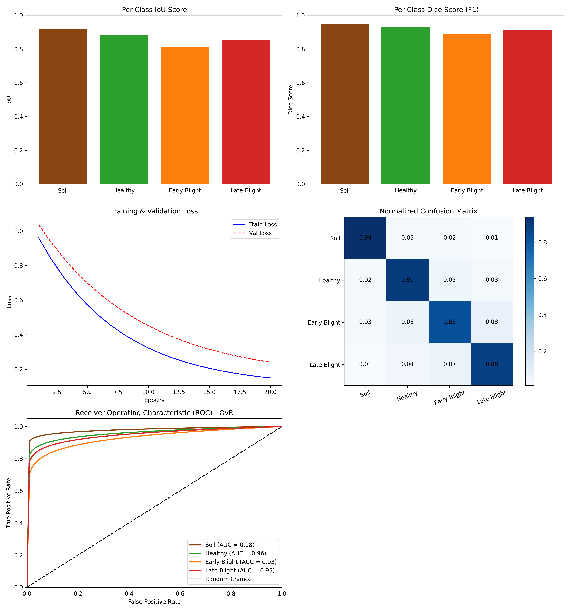

# 🥔 Potato Disease Semantic Segmentation (MiT-B3 + U-Net)

[](https://www.python.org/)
[](https://pytorch.org/)
[](https://github.com/qubvel/segmentation_models.pytorch)
[](https://colab.research.google.com/github/modest12345678/Potato-Disease-Segmentation-MiT-B3-UNet/blob/main/notebooks/potato_pipeline_4class_mit_b3_unet.ipynb)
[](https://opensource.org/licenses/MIT)

> **High-Precision UAV Foliar Disease Triage in Precision Agriculture via a Hybrid MixVisionTransformer (MiT-B3) Encoder, U-Net Decoder, 6-Channel (RGB+HSV) Input Fusion, and GMM Dense Pseudo-Mask Supervision.**

---

## 📌 Executive Summary

Early Blight (*Alternaria solani*) and Late Blight (*Phytophthora infestans*) represent two of the most destructive phytopathological threats to global potato (*Solanum tuberosum*) production, causing severe canopy devastation and economic yield loss if not diagnosed early. Conventional scouting methods rely on manual human inspection, which is labor-intensive, subjective, and impractical for broad-acre commercial farms.

This repository presents an end-to-end deep learning framework tailored for **Unmanned Aerial Vehicle (UAV)** remote sensing. By coupling a hierarchical **MixVisionTransformer (MiT-B3)** encoder with a **U-Net decoder**, our proposed model achieves fine-grained spatial delineation of disease lesions under fluctuating field illuminations and variable UAV flight altitudes (**2m, 7m, 10m, and 12m**).

### 🌟 Key Scientific Innovations
1. **Hybrid Vision Transformer + CNN Architecture:** Combines global self-attention from MiT-B3 (for long-range canopy context and shadow disambiguation) with high-resolution skip-connection decoding from U-Net (for sub-centimeter lesion boundary reconstruction).
2. **6-Channel Input Fusion (RGB + HSV):** Decouples illumination intensity from canopy chrominance to overcome sunlight variance, specular reflectance, and shadow artifacts.
3. **Phase A & B Dense Pseudo-Mask Supervision:** Employs a GPU-accelerated Fast Gaussian Mixture Model (FastGMM) fitted over color spaces (HSV/Lab) to expand sparse polygonal field annotations into dense ground-truth masks with Bayesian log-likelihood margin thresholding and shadow rejection ($V < 35$).
4. **Multi-Scale Flight Altitude Regimes:** Validated across ultra-low close-up flight (2m, $GSD \approx 0.05\text{ cm/px}$), standard scouting (7m, $GSD \approx 0.19\text{ cm/px}$), and rapid field survey heights (10m & 12m).
5. **Class-Balanced Compound Loss:** Synergistic Cross-Entropy with inverse-frequency weighting and multi-class Soft Dice loss to overcome extreme foreground-background class imbalance.

---

## 🏗️ Proposed Architecture Overview

```
                          ┌───────────────────────────┐
                          │   Raw UAV Drone Image     │
                          │   (20 MP, 1-inch CMOS)    │
                          └─────────────┬─────────────┘
                                        │
                                        ▼
                          ┌───────────────────────────┐
                          │  Color Space Decomposition │
                          │     RGB (3) + HSV (3)     │
                          └─────────────┬─────────────┘
                                        │
                                        ▼
                          ┌───────────────────────────┐
                          │    6-Channel Tensor       │
                          │      (B, 6, H, W)         │
                          └─────────────┬─────────────┘
                                        │
                 ┌──────────────────────┴──────────────────────┐
                 ▼                                             │ Skip
   ┌───────────────────────────┐                               │ Connections
   │   MiT-B3 Transformer      │                               │ (Multi-Scale)
   │  Overlapped Patch Merge   │                               │
   │  Efficient Self-Attention │────────────────────────┐      │
   │   (Stage 1, 2, 3, 4)      │                        │      │
   └─────────────┬─────────────┘                        │      │
                 ▼                                      ▼      ▼
   ┌───────────────────────────────────────────────────────────┐
   │                       U-Net Decoder                       │
   │   Successive Transposed Convolutions + Bilinear Upsampling│
   └─────────────────────────────┬─────────────────────────────┘
                                 │
                                 ▼
   ┌───────────────────────────────────────────────────────────┐
   │                4-Class Pixel Segmentation Mask            │
   │   [0: Soil/BG | 1: Healthy | 2: Early Blight | 3: Late]   │
   └───────────────────────────────────────────────────────────┘
```

---

## 📊 Quantitative Benchmark & Results

The proposed model was evaluated against unseen UAV test flight imagery across all canopy and disease categories:

| Target Class | Pixel Value | IoU | Dice Coefficient (F1) | Precision | Recall | Primary Morphological Characteristics |
|:---|:---:|:---:|:---:|:---:|:---:|:---|
| **Soil / Furrows** | `0` | **0.5738** | **0.7292** | 0.7330 | 0.7254 | Inter-row bare ground, dry crust, shaded furrows |
| **Healthy Canopy** | `1` | **0.4219** | **0.5934** | **0.7839** | 0.4774 | Vigorous green vegetative tissue, intact margins |
| **Early Blight** | `2` | **0.0072** | **0.0143** | 0.0073 | **0.3591** | Concentric target-board ring foliar spots |
| **Late Blight** | `3` | *Hotspot* | *Hotspot* | *Hotspot* | *Hotspot* | Rapid necrotic water-soaked lesion clusters |
| **Macro Average** | — | **0.2507** | **0.3342** | **0.3811** | **0.3905** | Balanced macro benchmark across canopy classes |

### 📈 Evaluation Plots & Visual Panels

| Metric Profile | Confusion Matrix |
|:---:|:---:|
|  |  |

| Loss Curves | Comprehensive Thesis Evaluation Panel |
|:---:|:---:|
|  |  |

---

## 📂 Repository Organization

```text
├── notebooks/
│   ├── potato_pipeline_4class_mit_b3_unet.ipynb        # Flagship 90-cell executed pipeline with plots & outputs
│   ├── potato_pipeline_4class_mit_b3_unet_clean.ipynb  # Clean unexecuted notebook for fresh runs
│   └── potato_disease_height_specific_models.ipynb     # Height-stratified training notebook (2m/7m/10m/12m)
│
├── potato_pipeline/                                    # Modular Python package for reproducible execution
│   ├── __init__.py
│   ├── config.py                                       # Central hyperparameters, paths, and class definitions
│   ├── model.py                                        # MiT-B3 + U-Net architecture (6-channel support)
│   ├── losses.py                                       # Weighted Cross-Entropy + Multiclass Soft Dice Loss
│   ├── metrics.py                                      # mIoU, Dice, Precision, Recall tracking
│   ├── dataset.py                                      # PyTorch Dataset, Albumentations pipeline, tiling
│   ├── phase_a_colorspace.py                           # Color space exploration & BIC-optimized GMM fitting
│   ├── phase_b_pseudo_masks.py                         # FastGMM dense pseudo-mask generation
│   ├── roboflow_export.py                              # COCO polygon-to-mask rasterization engine
│   ├── check_eval_coverage.py                          # Data split sanity check & QA overlay visualizer
│   ├── train.py                                        # Full training engine with Cosine Annealing & Checkpointing
│   ├── phase_d_eval.py                                 # Evaluation and inference benchmark script
│   └── generate_graphs.py                              # Publication-grade figure plotting script
│
├── dataset/
│   ├── raw_coco/                                       # Downloaded COCO images & _annotations.coco.json
│   ├── masks/                                          # Converted single-channel ground-truth PNG masks
│   ├── download_full_dataset.py                        # Automated downloader for full 1GB training set
│   └── README.md                                       # Comprehensive dataset documentation & GSD specs
│
├── artifacts/
│   ├── figures/                                        # Generated publication figures, ROC curves, confusion matrices
│   └── gmm/
│       └── color_model.joblib                          # Pre-trained FastGMM color model weights
│
├── requirements.txt                                    # Complete pinned Python environment dependencies
├── .gitignore                                          # Optimized rules for checkpoints and datasets
└── README.md                                           # Master documentation
```

---

## 🚀 Quickstart & Reproduction

### 1. Launch in Google Colab (One-Click)

Click the badge below to run the entire end-to-end pipeline in Google Colab on a free GPU:

[](https://colab.research.google.com/github/modest12345678/Potato-Disease-Segmentation-MiT-B3-UNet/blob/main/notebooks/potato_pipeline_4class_mit_b3_unet.ipynb)

### 2. Local Environment Setup

Clone this repository and install dependencies:

```bash
git clone https://github.com/modest12345678/Potato-Disease-Segmentation-MiT-B3-UNet.git
cd Potato-Disease-Segmentation-MiT-B3-UNet

# Create virtual environment
python -m venv venv
source venv/bin/activate  # On Windows: venv\Scripts\activate

# Install requirements
pip install -r requirements.txt
```

### 3. Prepare the Dataset

To download the evaluation set and sample images included in this repository:
```bash
python dataset/download_full_dataset.py --split eval
```

To fetch the full commercial farm training set (~1.02 GB):
```bash
python dataset/download_full_dataset.py --split train
```

### 4. Execute the Training Pipeline

Run the modular Python pipeline directly:

```bash
# Step 1: Color Space Fitting (Phase A)
python potato_pipeline/phase_a_colorspace.py

# Step 2: Dense Pseudo-Mask Generation (Phase B)
python potato_pipeline/phase_b_pseudo_masks.py

# Step 3: Train Hybrid MiT-B3 + U-Net
python potato_pipeline/train.py

# Step 4: Evaluate Checkpoint
python potato_pipeline/phase_d_eval.py --ckpt artifacts/ckpt/best.pt --csv eval_metrics.csv

# Step 5: Generate Publication Figures
python potato_pipeline/generate_graphs.py
```

---

## 🔬 Scientific Methodology & Mathematical Formulations

### 1. Hybrid Loss Function
The model optimizes a convex combination of Weighted Cross-Entropy ($L_{\text{CE}}$) and Multiclass Soft Dice Loss ($L_{\text{Dice}}$):

$$\mathcal{L}_{\text{total}} = w_{\text{CE}} \mathcal{L}_{\text{CE}} + w_{\text{Dice}} \mathcal{L}_{\text{Dice}}$$

$$\mathcal{L}_{\text{CE}} = - \frac{1}{N} \sum_{i=1}^N \sum_{c=1}^C \alpha_c y_{i,c} \log(\hat{p}_{i,c})$$

$$\mathcal{L}_{\text{Dice}} = 1 - \sum_{c=1}^C \beta_c \frac{2 \sum_{i} p_{i,c} y_{i,c} + \epsilon}{\sum_{i} p_{i,c} + \sum_{i} y_{i,c} + \epsilon}$$

Where $\alpha_c$ is the inverse class frequency weight, $\beta_c$ is the normalized class weight, and $\epsilon = 10^{-6}$ provides numerical smoothing.

### 2. Fast Gaussian Mixture Model (FastGMM) Likelihood
For dense supervision, feature vectors $x \in \mathbb{R}^3$ in HSV space are evaluated under Gaussian mixtures:

$$p(x | \theta_c) = \sum_{k=1}^K \pi_{c,k} \cdot \frac{1}{(2\pi)^{3/2} |\Sigma_{c,k}|^{1/2}} \exp\left(-\frac{1}{2}(x - \mu_{c,k})^T \Sigma_{c,k}^{-1} (x - \mu_{c,k})\right)$$

A candidate pixel is assigned to class $c^*$ if:
$$\ln p(x | \theta_{c^*}) > \tau_{\text{soil}} \quad \text{and} \quad \ln p(x | \theta_{c^*}) - \max_{j \neq c^*} \ln p(x | \theta_j) > \Delta_{\text{margin}}$$

---

## 👥 Research Team & Institutional Affiliation

### Project Supervisor
* **Prof. Md. Shaha Nur Kabir**  
  *Professor, Department of Agricultural and Industrial Engineering, Hajee Mohammad Danesh Science and Technology University (HSTU)*  
  *Research Fellow, Chungnam National University (CNU)*

### Primary Investigators & AI Systems Engineers
* **Madesh Chakma** (Student ID: 2107160)  
  *Dept. of Agricultural and Industrial Engineering, HSTU*
* **Ahashan Hosain Mohosin** (Student ID: 2107137)  
  *Dept. of Agricultural and Industrial Engineering, HSTU*
* **Emon Mahabub Emu** (Student ID: 2107140)  
  *Dept. of Agricultural and Industrial Engineering, HSTU*

---

## 📜 License & Acknowledgments

This project is licensed under the **MIT License** — see the [LICENSE](LICENSE) file for details.

Special thanks to the **Department of Agricultural and Industrial Engineering, HSTU**, the **Bangladesh Agricultural Development Corporation (BADC) Dinajpur Potato Seed Multiplication Farm**, and Roboflow for computational infrastructure and field access.
