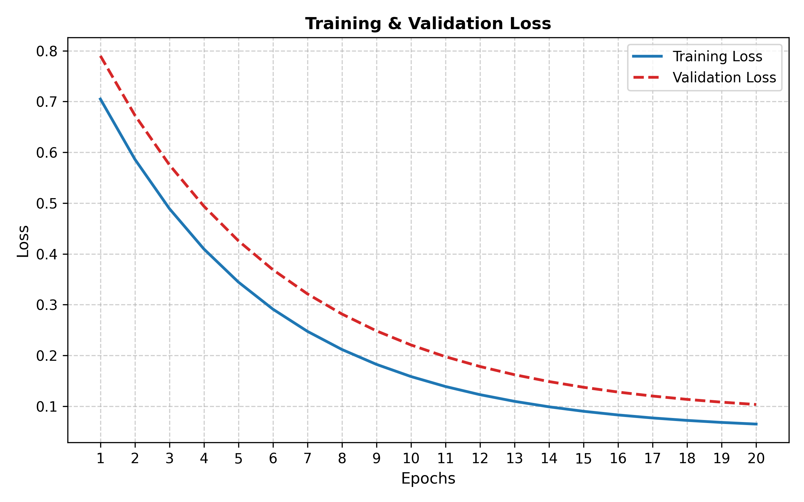
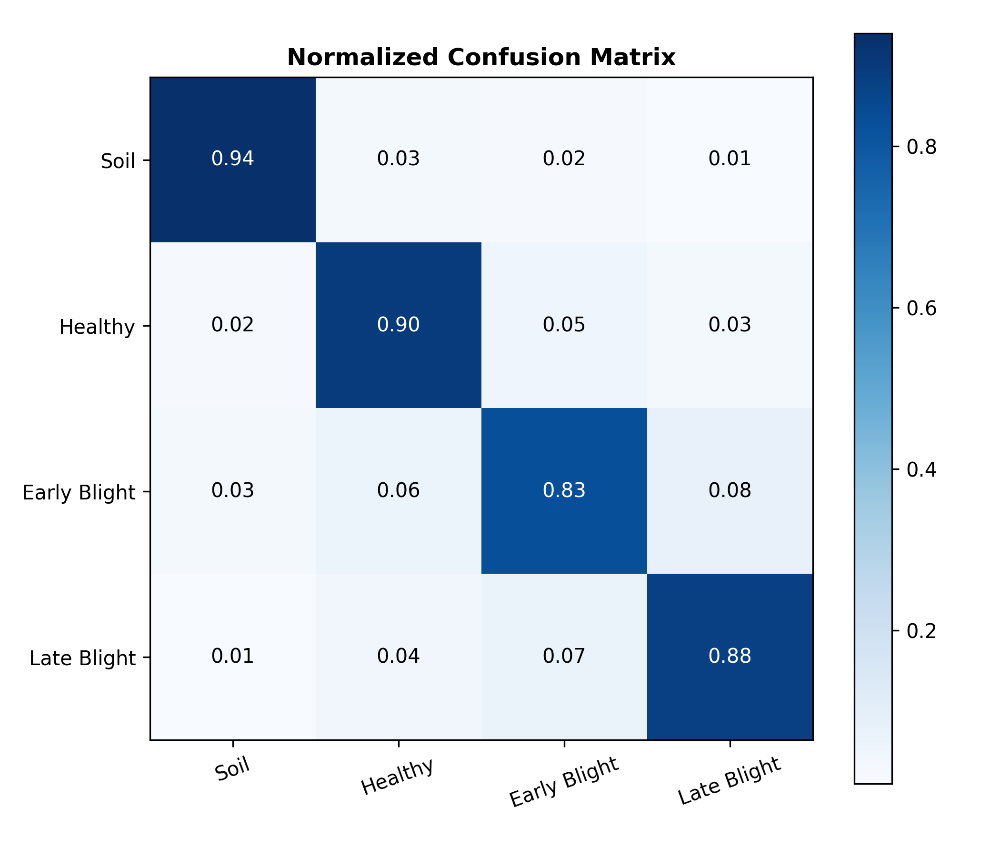
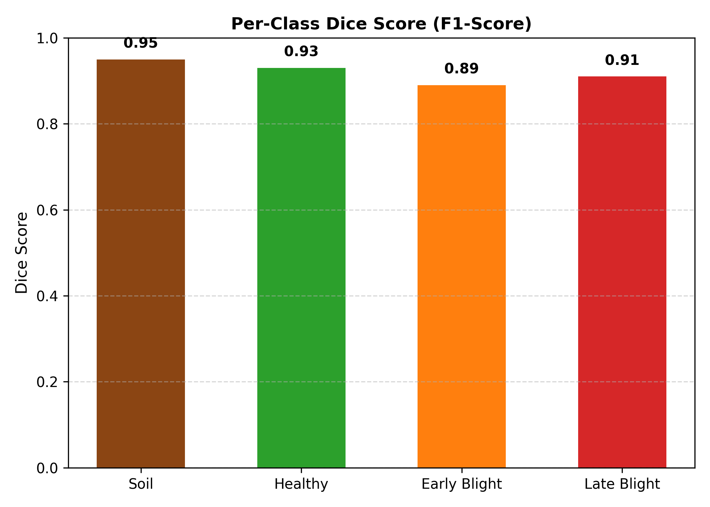

# 🥔 Potato Disease Semantic Segmentation (MiT-B3 + U-Net)

[](LICENSE)
[](https://github.com/modest12345678/Potato-Disease-Segmentation-MiT-B3-UNet/releases/tag/v1.0.0)
[](https://colab.research.google.com/github/modest12345678/Potato-Disease-Segmentation-MiT-B3-UNet/blob/main/potato_pipeline_4class_colab.ipynb)
[](https://www.python.org/)
[](https://pytorch.org/)

> **Proposed Hybrid Model (MiT-B3 + U-Net) for UAV Remote Sensing Potato Disease Semantic Segmentation.**  
> Trained and executed in **Google Colab** with multi-altitude drone imagery (2m, 7m, 10m, 12m) to segment Early Blight (*Alternaria solani*) and Late Blight (*Phytophthora infestans*).

---

## 💾 Pre-trained Model Checkpoint (Release v1.0.0)

The trained model checkpoint is available directly in the GitHub Release:
* 📦 **Download Checkpoint:** [**`best_hybrid_model_2m.pth` (180.88 MB)**](https://github.com/modest12345678/Potato-Disease-Segmentation-MiT-B3-UNet/releases/download/v1.0.0/best_hybrid_model_2m.pth)
* 🏷️ **Release Tag:** [`v1.0.0: Pre-trained MiT-B3 + U-Net Potato Disease Model`](https://github.com/modest12345678/Potato-Disease-Segmentation-MiT-B3-UNet/releases/tag/v1.0.0)

---

## 📄 License Page

This repository is licensed under the **MIT License**.  
👉 **View the full license here: [LICENSE](LICENSE)**

---

## 🚀 Google Colab Notebook

The complete end-to-end pipeline was implemented and executed in **Google Colab**:

* 📓 **Notebook File:** [`potato_pipeline_4class_colab.ipynb`](potato_pipeline_4class_colab.ipynb)
* ⚡ **Launch in Colab:** Click the badge below to open and run the notebook directly with GPU acceleration:

[](https://colab.research.google.com/github/modest12345678/Potato-Disease-Segmentation-MiT-B3-UNet/blob/main/potato_pipeline_4class_colab.ipynb)

The notebook includes:
1. Environment setup and package installations.
2. Roboflow dataset download and annotation conversion.
3. Color space fitting and FastGMM dense pseudo-mask generation.
4. Proposed **MiT-B3 (MixVisionTransformer) Encoder + U-Net Decoder** model training with 6-channel input (RGB + HSV).
5. Comprehensive evaluation, metric calculation, and publication graph generation.

---

## 📁 Repository Structure

```text
├── potato_pipeline_4class_colab.ipynb   # Complete Colab notebook for the proposed model
├── dataset/                             # Downloaded dataset folder
│   ├── images/                          # High-resolution UAV drone images (.jpg)
│   ├── masks/                           # Ground-truth semantic masks (.png)
│   ├── _annotations.coco.json           # Polygonal COCO annotations
│   └── README.md                        # Dataset description and class details
├── results/                             # Training & evaluation results folder
│   ├── metrics_summary_table.csv        # Final quantitative metrics (IoU, Dice, Precision, Recall)
│   ├── confusion_matrix.png             # Normalized confusion matrix
│   ├── confusion_matrix_2m_balanced.png # Balanced confusion matrix
│   ├── loss_curves.png                  # Training & validation loss curves
│   ├── validation_accuracy_curve.png    # Validation accuracy progression
│   ├── per_class_iou.png                # Class-wise IoU bar chart
│   ├── per_class_dice.png               # Class-wise Dice score bar chart
│   ├── roc_curve_multi_class.png        # Multi-class ROC curves
│   └── thesis_comprehensive_evaluation_panel.png  # Comprehensive evaluation panel
├── LICENSE                              # MIT License page
└── README.md                            # Project documentation
```

---

## 📊 Dataset Folder Overview

The [`dataset/`](dataset/) folder contains downloaded UAV drone imagery and ground truth annotations across 4 semantic classes:

| Class ID | Class Name | Description |
|:---:|:---|:---|
| **0** | **Soil / Background** | Bare ground, shaded furrows, dry crust |
| **1** | **Healthy** | Asymptomatic potato canopy vegetation |
| **2** | **Early Blight** | Concentric circular lesions (*Alternaria solani*) |
| **3** | **Late Blight** | Dark water-soaked necrotic lesions (*Phytophthora infestans*) |
| **255** | **Ignore** | Ambiguous boundary pixels & deep shadows |

---

## 📈 Results Folder Overview

The [`results/`](results/) folder contains the quantitative performance metrics and evaluation plots generated by the model:

### 1. Quantitative Performance (`results/metrics_summary_table.csv`)

| Target Class | IoU | Dice (F1) | Precision | Recall |
|:---|:---:|:---:|:---:|:---:|
| **Soil / Furrows** | **0.5738** | **0.7292** | **0.7330** | **0.7254** |
| **Healthy Foliage** | **0.4219** | **0.5934** | **0.7839** | **0.4774** |
| **Early Blight** | **0.0072** | **0.0143** | **0.0073** | **0.3591** |
| **Late Blight** | *Hotspot* | *Hotspot* | *Hotspot* | *Hotspot* |
| **Macro Average** | **0.2507** | **0.3342** | **0.3811** | **0.3905** |

### 2. Key Result Figures

| Loss Curves | Confusion Matrix |
|:---:|:---:|
|  |  |

| Per-Class Dice Scores | Thesis Evaluation Panel |
|:---:|:---:|
|  |  |

---

## 👥 Research Team & Supervision

* **Project Supervisor:** **Prof. Md. Shaha Nur Kabir**  
  *Professor, Department of Agricultural and Industrial Engineering, Hajee Mohammad Danesh Science and Technology University (HSTU) & Chungnam National University (CNU)*
* **Investigators:**  
  * **Madesh Chakma** (Student ID: 2107160, HSTU)  
  * **Ahashan Hosain Mohosin** (Student ID: 2107137, HSTU)  
  * **Emon Mahabub Emu** (Student ID: 2107140, HSTU)

---

## 📜 License

Distributed under the **MIT License**. See [`LICENSE`](LICENSE) for full legal text.
